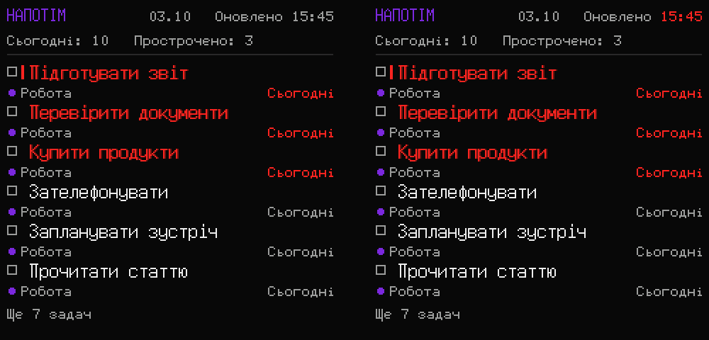

# Napotim ESP Monitor

Настільний екран задач із [Напотім](https://napotim.duckdns.org) на базі ESP8266.
Прошивка для **GeekMagic SmallTV-Ultra / ESP-12F** із дисплеєм ST7789 240×240
показує найважливіші задачі на сьогодні та прострочені задачі й оновлює їх через Wi-Fi.

Версія: **1.2.0**. Перевірене обладнання: SmallTV-Ultra.



*Вигадані задачі. Праворуч лише час останнього успішного оновлення червоний;
лічильник непоказаних задач залишається внизу.*

## Можливості

- До шести активних підтверджених задач із дедлайном сьогодні або раніше.
- Категорії, дедлайни та високий пріоритет. Задачі сортуються за пріоритетом,
  потім дедлайном; задачі без конкретного часу йдуть наприкінці дня.
- Дата по центру, `Оновлено HH:MM` праворуч, `Ще N задач` унизу.
- У часі оновлення перемальовуються лише змінені цифри, без попереднього
  стирання; напис `Оновлено` залишається статичним.
- Оновлення раз на хвилину; перший запит — одразу після готовності Wi-Fi та часу.
- За втрати зв'язку останні отримані дані лишаються на екрані, а час стає червоним.
- Яскравість, денний/нічний розклад і поворот налаштовуються в Напотім.
- Нічний сон: екран і підсвітка повністю вимикаються, пробудження — на початку дня.
  Розклад працює без Wi-Fi після синхронізації часу.

Після вимкнення живлення список задач не зберігається: потрібне нове отримання з сервера.

## Що потрібно

- **GeekMagic SmallTV-Ultra**, ESP8266 / ESP-12F, ST7789 240×240.
- Живлення USB-C і Wi-Fi **2,4 ГГц** із паролем та доступом до інтернету.
- Обліковий запис Напотім із розділом **Налаштування → Інтеграції**.
- Встановлена прошивка — див. [встановлення](#встановлення-прошивки).

Інші моделі SmallTV чи ESP-плати можуть мати інші піни й дисплей; для них потрібна
адаптація. На перевіреному Ultra USB-C використовується для живлення.

## Як підключити до Напотім

1. **Отримайте ключ доступу.** У Напотім відкрийте **Налаштування → Інтеграції**,
   введіть **«Назва екрана»**, натисніть **«Додати екран»** і скопіюйте ключ.
   Ключ показується лише під час створення — збережіть його до закриття повідомлення.
2. **Увімкніть екран.** Якщо підключення до збереженого Wi-Fi не вдалося,
   приблизно через 30 секунд з'явиться мережа **`Napotim-Setup`**. Пароль мережі
   та локальних налаштувань показується на дисплеї.
3. **Налаштуйте Wi-Fi.** Підключіть телефон або комп'ютер до `Napotim-Setup`,
   відкрийте **`http://192.168.4.1`** і увійдіть: користувач **`admin`**,
   пароль — із дисплея. Введіть назву й пароль домашньої мережі.
4. **Відкрийте локальні налаштування.** Після підключення дисплей покаже IP-адресу.
   Поверніть телефон або комп'ютер у ту саму домашню мережу, відкрийте
   **`http://<IP-адреса>`** й увійдіть з тими самими даними.
5. **Прив'яжіть пристрій.** Вставте ключ у поле **«Ключ із Напотім → Налаштування
   → Інтеграції»** та натисніть **«Зберегти»**. Після синхронізації з'являться задачі.
6. **Виберіть налаштування екрана.** Яскравість, розклад і поворот можна змінити
   в цій інтеграції у Напотім; зміни надходять із наступним оновленням задач.

Пароль облікового запису Напотім на ESP не передається. Ключ дозволяє отримувати
дані; пристрій не змінює задачі. `Napotim-Setup` закривається після підключення
домашнього Wi-Fi та збереження ключа. Ключ можна відкликати в застосунку.

## Нічний сон

У **Налаштування → Інтеграції → Налаштування екрану** увімкніть
**«Нічний сон: вимикати екран»**, задайте початок сну (наприклад, `00:00`).
Пробудження використовує **«Початок дня»** (наприклад, `08:00`); у ручному
режимі яскравості воно показане окремим полем. Сон працює в обох режимах.
Наявна нічна яскравість тепер називається вечірньою. Для розкладу яскравості
порядок — день → вечір → сон → день, інтервали від 15 хвилин.
За замовчуванням сон вимкнено, оновлення не змінює поточний розклад.

Ті самі параметри доступні на локальній сторінці плати. Виберіть джерело
**«Ця плата»**, щоб сервер не перезаписував локальні зміни; **«Напотім»** повертає
керування сайту. Часовий пояс в обох випадках береться з облікового запису.

| Сценарій | Поведінка |
| --- | --- |
| Настав час сну | 4 секунди повідомлення про сон і час пробудження, потім екран повністю гасне. |
| Wi-Fi чи інтернет зникли після синхронізації | Сон і пробудження виконуються за годинником плати; зберігаються останні задачі. Після відновлення зв'язку дані оновлюються. |
| Живлення ввімкнули вночі | Після отримання часу — повідомлення про сон і вимкнення екрана до ранку. |
| Після втрати живлення немає інтернету / точного часу | Повідомлення про очікування часу, через 15 секунд екран гасне; Wi-Fi, NTP і локальні налаштування продовжують працювати. Після синхронізації екран прокинеться або залишиться спати відповідно до розкладу. |
| Вранці немає електрики | Плата не може прокинутися без живлення. Після його повернення визначає поточний режим за точним часом. |
| Час відновився вже після пробудження | Екран одразу вмикається; пропущена подія пробудження не залишає його в сні. |
| Налаштування змінили під час сну | Плата продовжує синхронізацію; вимкнення сну або зміна розкладу на активний час вмикає екран. Локальна сторінка й OTA доступні. |

Це сон ST7789 і повне вимкнення підсвітки, з modem sleep Wi-Fi, а не deep sleep
ESP8266: таймер deep sleep потребує підтвердженого з'єднання GPIO16 → RST.
Годинник працює, поки є живлення. Після його втрати без зовнішнього годинника
неможливо визначити актуальний час офлайн; збережений старий час не використовується
як поточний. У такому випадку екран може бути вимкнений і вдень до синхронізації.

## Встановлення прошивки

### Збірка

Потрібні Python 3 і PlatformIO. Для Linux / WSL / macOS:

```bash
git clone https://github.com/Andrii-Yukhymenko/napotim-esp-monitor.git
cd napotim-esp-monitor
python3 -m venv .venv
source .venv/bin/activate
python -m pip install platformio==6.1.18
pio run -e ultra
```

На Windows можна використати PlatformIO у VS Code або Python; команда активації
середовища в PowerShell — `.venv\Scripts\Activate.ps1`.

Результат: **`.pio/build/ultra/firmware.bin`**. Публічна збірка не містить паролів
Wi-Fi чи ключів Напотім; новий пристрій генерує пароль налаштувань сам.
Готову автоматичну збірку можна отримати в GitHub **Actions**: відкрийте успішний
запуск **Firmware checks** і завантажте артефакт **`firmware-ultra`**.

### Перша інсталяція на Ultra

1. У заводській прошивці підключіть Ultra до домашнього Wi-Fi й знайдіть його IP.
2. Відкрийте заводську сторінку **`http://<IP-адреса>/update`**.
3. Завантажте зібраний образ. Для перевіреної заводської версії Ultra-V9.0.54
   перша інсталяція виконувалася з gzip-стиснутим файлом:

   ```bash
   gzip -c .pio/build/ultra/firmware.bin > firmware.bin.gz
   ```

4. Дочекайтеся завершення та перезапуску, не відключаючи живлення.
5. Налаштуйте мережу й ключ за [інструкцією](#як-підключити-до-напотім).
   Заводські Wi-Fi-налаштування можуть не перенестися.

Це замінює заводську прошивку; повна резервна копія flash потребує UART.
Для заводського слота, який не вміщує головний образ, є
[додатковий loader](docs/technical.md#додатковий-loader).

### Подальші оновлення

Відкрийте локальну IP-адресу, увійдіть як `admin`, виберіть **«Оновити прошивку»**
й завантажте звичайний **`firmware.bin`**, без gzip. Ключ і налаштування дисплея
зберігаються в LittleFS після звичайного OTA-оновлення.

## Якщо задачі не з'являються

| Стан | Що перевірити |
| --- | --- |
| Очікування Wi-Fi | Назву, пароль, діапазон 2,4 ГГц і сигнал. Після 30 секунд доступна мережа налаштування. |
| Очікування часу | Доступ до інтернету й NTP. Час потрібен для перевірки HTTPS-сертифіката. |
| Отримання задач | Виконується запит до сервера; слабкий зв'язок може сповільнити відповідь. |
| Очікування повтору | Запит не вдався. До першого успіху повтор відбувається через 3 секунди після завершення спроби. |
| Червоний час | Оновлення не вдалося або зник Wi-Fi; показуються останні отримані дані. |
| Немає задач | Перевірте дедлайни й статуси: показуються активні підтверджені задачі на сьогодні або раніше. |
| Недійсний ключ | Створіть новий ключ у **Налаштування → Інтеграції** та повторіть прив'язку. |

## Для розробників

```bash
bash scripts/test-display-settings.sh
bash scripts/test-night-mode.sh
bash scripts/test-poll-schedule.sh
bash scripts/test-snapshot-reader.sh
bash scripts/test-update-status.sh
```

Для перевірок потрібен `g++`; GitHub Actions запускає їх перед збіркою.
Після збірки `python3 tests/update_glyph_test.py` перевіряє кольори та фон
цифр із фактичним декодером шрифту U8g2.
API: `https://napotim.duckdns.org/api/device/v1/today`. Для власного сервера змініть
`API_URL` у `src/main.cpp`.

- [Піни, API, пам'ять, розклад і діагностика](docs/technical.md).
- [Історія змін](CHANGELOG.md).
- [Джерело шрифту](fonts/README.md) та [атлас для preview](preview/README.md).

Приватні заголовки, паролі, ключі, журнали й локальні збірки виключені через
`.gitignore`. Misc Fixed — public domain; повідомлення про сторонній декодер
збережено в [preview/LICENSE-fonts.txt](preview/LICENSE-fonts.txt).
